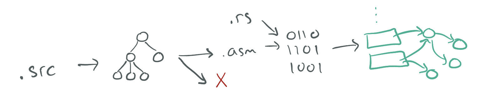

# UCSD CSE 231 (Sp24)

## Crew

- [Ranjit Jhala](https://ranjitjhala.github.io) (Instructor)
- Nico Lehmann (TA, 🦀)
- Matthew Kolosick (TA)
- Michael Borkowski (TA)

(with **many thanks** to [Joe Politz](https://jpolitz.github.io) from whom much of this material is gratefully borrowed!) 

[Basics](#basics) -
[Resources](#resources) -
[Schedule](#schedule) -
[Staff](#staff) -
[Grading](#grading) -
[Policies](#policies)

In this course, we'll explore the implementation of **compilers**: programs that
transform source programs into other useful, executable forms. This will
include understanding syntax and its structure, checking for and representing
errors in programs, writing programs that generate code, and the interaction
of generated code with a runtime system.

We will explore these topics interactively in lecure, you will implement
an increasingly sophisticated series of compilers throughout the course to
learn how different language features are compiled, and you will think
through design challenges based on what you learn from implementation.

This web page serves as the main source of announcements and resources for the
course, as well as the syllabus.

## Basics

- **Lecture:** *Center 105* Tu-Th 2:00-3:20pm
- **Discussion:** *CENTER 212* Fr 2:00-2:50pm
- **Exams:** *(In Friday Discussion Section)* May 3 (Week 5), May 31 (Week 9)
- **Final Exam:** *(Optional, to make up exam credit)* Tue June 11, 3:00-6:00pm (CENTER 105)
- Podcasts: [podcast.ucsd.edu](https://podcast.ucsd.edu/watch/sp24/cse231_a00)
- Q&A Forum: [Piazza](https://piazza.com/ucsd/spring2024/cse231)
- Gradescope: [https://www.gradescope.com](https://www.gradescope.com)

## Office Hours

- Ranjit  (Thu 1pm - 2pm in CSE 3110)
- Michael (Fri 4pm - 5pm in CSE 3217)
- Nico    (Thu 10am-11am https://ucsd.zoom.us/j/98350873892, Fri 10am-11am CSE 240A)
- Matt    (Wed 10am-12pm https://ucsd.zoom.us/j/2499498988)

## Resources

Textbook/readings: There's no official textbook, but we will link to
different online resources for you to read to supplement lecture. Versions
of this course have been taught at several universities, so sometimes I'll
link to those instructors' materials as well. 

Some useful resources are:

- [The Rust Book](https://doc.rust-lang.org/book/) (also [with embedded quizzes](https://rust-book.cs.brown.edu/))
- [An Incremental Approach to Compiler Construction](http://scheme2006.cs.uchicago.edu/11-ghuloum.pdf)
- [UMich EECS483](https://maxsnew.com/teaching/eecs-483-fa22/)
- [Northeastern CS4410](https://courses.ccs.neu.edu/cs4410/)

## Schedule

The schedule below outlines topics, due dates, and links to assignments. The
schedule of lecture topics might change slightly, but I post a general plan so
you can know roughly where we are headed.

The typical due dates are that **assignments** and **quizzes** are due Friday evenings.

### Week 4 - Functions and Calling Conventions

- [Assignment (due Friday, May 3, 11:59pm)](./week5/index.md)
- Handouts and recordings:
  - Tuesday Handout: [(pdf)](static/week4_tue.pdf)
- Reading and Resources:
  - [Lerner/New on Errors](https://maxsnew.com/teaching/eecs-483-fa21/lec_function-calls_notes.html)
  - [Lerner/New on Defining Functions](https://maxsnew.com/teaching/eecs-483-fa21/lec_function-defs_notes.html)
  - [Lerner on Tail Calls](https://course.ccs.neu.edu/cs4410sp20/lec_tail-calls_stack_notes.html)

### Week 3 - Tags, Conditionals, and Loops

- [Assignment (due Friday, April 26)](./week3/index.md)
- [Assignment on Github Classroom](https://classroom.github.com/a/tnyP6D51)
- Handouts:
  - Thu Handout: [(pdf)](static/week3_thu.pdf)
- [Lecture code](https://github.com/ucsd-cse231/sp24-code/tree/main/stash)

- Reading and resources:
  - [Memory Representation of Values in Ocaml](https://dev.realworldocaml.org/runtime-memory-layout.html)
    _More discussion of a language with tagged value representations (and Ocaml
    is type-checked!)._
  - [V8 Blog Post Including Number Representations](https://v8.dev/blog/pointer-compression)
    _This goes a little further than we are right now, but focus on the fact
    that V8, one of the widely deployed JS engines, uses tag bits for
    its numbers._

### Week 2 - Binary Operators, Booleans, and Conditionals

- [Assignment (due Friday, April 12, 11:59pm)](./week2/index.md)
- [Assignment on Github Classroom](https://classroom.github.com/a/P5qpkKKh)
- Handouts:
  - Tue Handout: [(pdf)](static/week2_tue.pdf)
  - Thu Handout: [(pdf)](static/week2_thu.pdf)
- Reading and resources:
  - [Max New on Let and the Stack](https://maxsnew.com/teaching/eecs-483-fa21/lec_let-and-stack_notes.html)
    _Max New and Ben Lerner have done a nice job writing up notes on let-bindings and the stack. 
    They don't use exactly the same style or make the same decisions as CSE231, but things are
    close enough to be useful._

### Week 1 - Rust and Source to Assembly Conversion

- [Assignment (due Friday, April 5, 23:59:59)](./week1/index.md) 
- [Assignment on Github Classroom](https://classroom.github.com/a/8_IhC3V5)
- Reading and resources:
  - [Tue 4/1 Handout](https://drive.google.com/file/d/1AOZ-MRYc1DYdbBlz6xkMrETaeCfHujZI/view?usp=share_link) 
  - [Thu 4/3 Handout](https://drive.google.com/file/d/1eYTybBS3QNRYkhIbsEnPCHXGACMqEJ5p/view?usp=share_link) [(pptx)](https://docs.google.com/presentation/d/1gGeC4Wp68sHLZLR6YbPAAdJk3NevdYcM/edit?usp=share_link&ouid=117453768726816085396&rtpof=true&sd=true)
  - [Week 1 markup](./static/week1.pdf)
  - [Rust Book Chapters 1-6](https://doc.rust-lang.org/book)
  - [x86-64 quick reference (Stanford)](https://web.stanford.edu/class/archive/cs/cs107/cs107.1196/guide/x86-64.html)
  - [x86-64 quick reference (Brown)](https://cs.brown.edu/courses/cs033/docs/guides/x64_cheatsheet.pdf)

## Staff 

**Office hours** are concentrated on Wed, Thu, Fri, since most
assignments are due Friday evening. Please check the calendar before you come
in case there have been any changes. When you come to the office hour, we may
ask you to put your name in the queue using the whiteboard. Read the
description about [collaboration below](#policies) for some context about
office hours. The office hours schedule is below; each event has details about
remote/in-person:

## Grading

Your grade will be calculated from  **assignments**, **exams**, **participation** and **quizzes**.

**Assignments** are given periodically, typically at one or two week intervals.
On each you'll get a score from 0-3 (Incomplete/No Pass, Low Pass, Pass, High Pass).

There are two **exams** in the course, one in week 5 and one in week 9, given
in the Friday discussion sections. Tests also get a score from 0-3. Finals week
and the usual final exam block will give an opportunity to make up credit on
these if you miss them or get low scores.

For the **participation** credit, most lectures will come with a 1-2 page handout, and you can submit
the handout any time up until the start of the next lecture. Credit is given
for reasonable effort in engaging with the notes from the day on the handout.

**Quizzes** will release each week around Wednesday, and be due Sunday evening.
These serve as a review of the past week and a preview of the coming week.

The standards for grade levels are:

- **A**:
  - Exam point total 5 or higher (High Pass on one exam and Pass or better on the other) (including final make-up)
  - **One of**:
    - High Pass on half the assignments, Pass on others, no missing assignments
    - High Pass on 4 of 5 assignments from A4 (Caduceus) and later (planned
      8 total assignments, actual total TBD), any grade on the other
      assignmentst. (If we end up with less than 8, I'll update this)

- **B**:
  - Exam point total 4 or higher (one High Pass and one Low Pass, or two Passes) (including final make-up)
  - **One of**:
    - Pass or above on all assignments, up to one missing assignment
    - High pass on two assignments from A1-4, High pass on two
      assignments from A5-8, any grade on others

- **C**
  - Exam point total 3 or higher (including final make-up)
  - Pass or above on half the assignments, any score on the others

You get credit for a quiz by getting most of the questions right.

**Engagement** is used to add +/- modifiers at the end of the quarter, and
won't make the difference between A/B/C etc.

**Comprehensive Exam**: For graduate students using this course for a
comprehensive exam requirement, you must get "A" achievement on the exams. Note
that you can use the final exam make-up time to do this!

## Policies

### Programming

In your professional programming life, some of your work will be highly
collaborative with lots of expert advice available from senior developers and
from sites like StackOverflow. This is a common case in many Web-focused
companies, in academia, and on open-source projects. It’s a great way to get
exposed to new techniques, share knowledge, and generally enjoy teamwork. In
contrast, some of your work will involve figuring out programming problems on
your own, where you are the first person to encounter an issue, or the first
person to try using a new library in the context of your application. You
should get experience in both types of situations; we might call the former
kind of process **open to collaboration** and the latter **closed to
collaboration**.

In terms of courses, this split also makes sense. Programming assignments
serve (at least) two roles. First and foremost, they are a mechanism for you
to learn! By directly applying the techniques and skills we discuss in class,
you get practice and become a better programmer. Second, they are an
assessment mechanism – as instructional staff we use them to evaluate your
understanding of concepts as demonstrated by your programs. Open
collaboration can reduce frustration while learning and give you chances to
enjoy collaboration and lots of help, but may not let us accurately evaluate
your understanding. Closed assignments are an opportunity for you to
demonstrate what you know by way of programming (and some of the frustration
of working through a problem on your own is _healthy_ frustration).

There are two types of assignments in this course:

- **Open collaboration** assignments, for which you can talk to anyone else in
  the course, post snippets of code online, get lots of help from TAs, and
  generally come up with solutions collaboratively. TAs will be happy to look
  at your code and suggest fixes, along with explaining them. There are a few
  restrictions:
  - Any code that you didn't write must be cited in the README file that goes
    along with your submission
    - **Example:** On an open collaboration assignment, you and another student
      chat online about the solution, you figure out a particular helper method
      together. Your README should say “The FOO function was developed in
      collaboration with Firstname Lastname”
    - **Example:** On an open collaboration assignment, a student posts the
      compilation strategy they used to handle a type of expression you were
      struggling with. Your README should say “I used the code from the forum
      post at [link]”
  - Anyone you work with in-person must be noted in your README
    - **Example:** You and another student sit next to each other in the lab,
      and point out mistakes and errors to one another as you work through the
      assignment. As a result, your solutions are substantially similar.  Your
      README should say “I collaborated with Firstname Lastname to develop my
      solution.”
  - You cannot share publicly your entire repository of code or paste an entire
    solution into a message board. Keep snippets to reasonable, descriptive
    chunks of code; think a dozen lines or so to get the point across.
  - You still _cannot_ use whole solutions that you find online (though
    copy-paste from Stack Overflow, tutorials etc, if you need help with Rust
    patterns, etc.) You shouldn't get assistance or code from students outside
    of this offering of the class. All the code that is handed in should be
    developed by you or someone in the class.
  - If you can get ChatGPT, Copilot, or another LLM to generate code that works
    for the course, feel free, but you **must** put comments in your code
    describing the prompt you used to get it if you do. If you have Copilot on,
    put a comment if it generates an entire method or match case.

  This doesn’t mean the staff will be handing out answers. We’ll mostly
  respond with leading questions and advice, and you shouldn’t expect a
  direct answer to questions like “am I done?” or “is my code right?”

  There is no guarantee the assistance you get from your classmates is
  correct. It is your responsibility to use your judgment to avoid using an
  idea on the course message board that is wrong, or doesn’t work with your
  solution; we won’t necessarily tell you one way or another while the
  assignment is out.

  If we see that you used code from other students and didn’t cite it in
  the README, the penalty will range from a point deduction to an academic
  integrity violation, depending on the severity. Always cite your work!

- **Closed collaboration** assignments, where you cannot collaborate with others.
  You can ask clarification questions as private posts or of TAs.
  However, TAs will not look at your code or comment on it. Lab/office hours
  these weeks are for conceptual questions or for questions about past
  assignments only, no code assistance. On these assignments:
  - You cannot look at or use anyone else's code for the assignment
  - You cannot discuss the assignment with other students
  - You cannot post publicly about the assignment on the course message
    board (or on social media or other forums). Of course, you can still
    post questions about material from lecture or past assignments!
  - All of the examples in the open collaboration section above would be
    academic integrity violations on a closed collaboration assignment
    **except** for using tutorials/LLMs. If you use code from tutorials/Stack
    Overflow/LLMs, cite them as described above.

You can always use code from class or shared by the instructional team
(properly attributed).

Programming assignments will **explicitly list** whether they are open 
or closed collaboration.

You should be familiar with [the UCSD guidelines](http://senate.ucsd.edu/Operating-Procedures/Senate-Manual/Appendices/2)
on academic integrity as well.

### Late Work

You have a total of *six late days* that you can use throughout the quarter,
but no more than *four late days* per assignment.

- A late day means anything between 1 second and 23
  hours 59 minutes and 59 seconds past a deadline
- If you submit past the late day limit, you get 0 points for that assignment
- There is no penalty for submitting late but within the limit

### Regrades

Mistakes occur in grading. Once grades are posted for an assignment, we will
allow a short period for you to request a fix (announced along with grade
release). If you don't make a request in the given period, the grade you were
initially given is final.

### Exams

There will be two exams during the quarter (held in discussion section) and a
final exam. There are no make-up exams for the tests during the quarter.
However, the final exam will have sections that correspond to each of the
in-class exams, and if your score on that part of the final is higher than
your score on that in-class exam, the exam score replaces it. This includes
the case where you miss an in-class exam (scoring a 0), but can regain credit
from that part of the final exam. This policy is designed to encourage you to
treat the in-class exams as _learning opportunities_ so that you can study
any mistakes you make and re-apply that knowledge on the final.

In addition, if you score high enough on the exams during the quarter, you can
skip the final exam with no penalty and just have the exam grades applied as
your exam score.

You are not allowed any study aids on exams, aside from those pertaining to
university-approved accommodations. References will be provided along with
exams to avoid unnecessary memorization.

You cannot discuss the content of exams with others in the course until grades
have been released for that exam.

Some past exams are available at the link below for reference on format
(content changes from offering to offering so this may not be
representative):

<https://drive.google.com/drive/folders/1yPxZ-nqRpC9Gz63JIavhQgfnyhA0uGIs?usp=sharing>

### Laptop/Device Policy in Lecture

There are lots of great reasons to have a laptop, tablet, or phone open
during class. You might be taking notes, getting a photo of an important
moment on the board, trying out a program that we're developing together, and
so on. The main issue with screens and technology in the classroom isn't your
own distraction (which is your responsibility to manage), it's the
distraction of **other students**. Anyone sitting behind you cannot help but
have your screen in their field of view. Having distracting content on your
screen can really harm their learning experience.

With this in mind, the device policy for the course is that if you have a
screen open, you either:

- Have only content onscreen that's directly related to the current lecture.
- Have unrelated content open and **sit in one of the back two rows of the
room** to mitigate the effects on other students. I may remind you of this
policy if I notice you not following it in class. Note that I really don't
mind if you want to sit in the back and try to multi-task in various ways
while participating in lecture (I may not recommend it, but it's your time!)

### Diversity and Inclusion

We are committed to fostering a learning environment for this course that
supports a diversity of thoughts, perspectives and experiences, and respects
your identities (including race, ethnicity, heritage, gender, sex, class,
sexuality, religion, ability, age, educational background, etc.).  Our goal is
to create a diverse and inclusive learning environment where all students feel
comfortable and can thrive.

Our instructional staff will make a concerted effort to be welcoming and
inclusive to the wide diversity of students in this course.  If there is a way
we can make you feel more included please let one of the course staff know,
either in person, via email/discussion board, or even in a note under the door.
Our learning about diverse perspectives and identities is an ongoing process,
and we welcome your perspectives and input.

We also expect that you, as a student in this course, will honor and respect
your classmates, abiding by the UCSD Principles of Community
(<https://ucsd.edu/about/principles.html>).  Please understand that others’
backgrounds, perspectives and experiences may be different than your own, and
help us to build an environment where everyone is respected and feels
comfortable.

If you experience any sort of harassment or discrimination, please contact the
instructor as soon as possible. If you prefer to speak with someone outside
of the course, please contact the Office of Prevention of Harassment and
Discrimination: <https://ophd.ucsd.edu/>.
