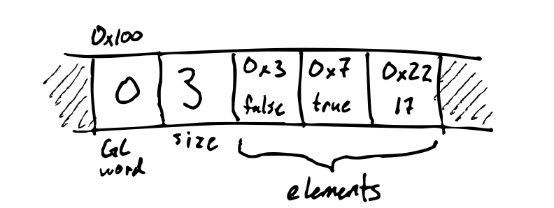
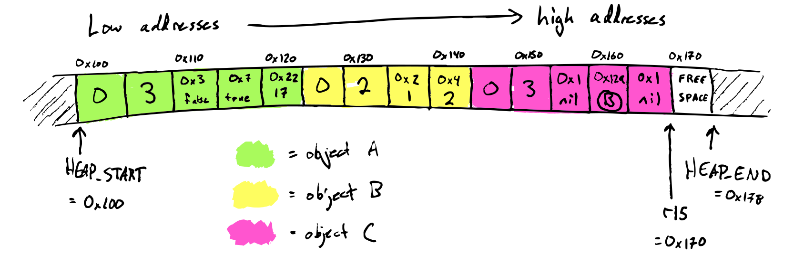
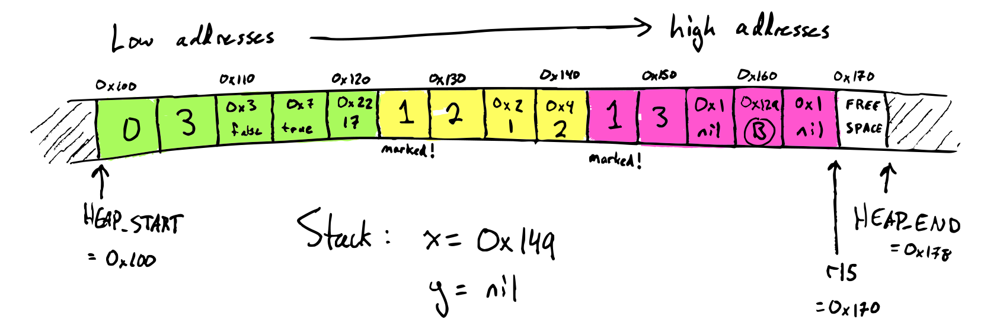
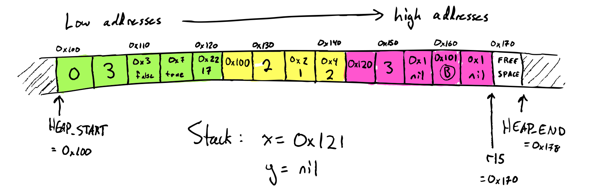
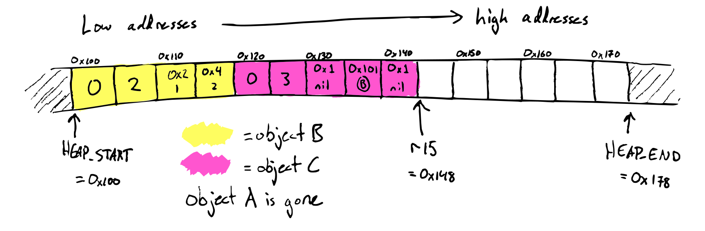
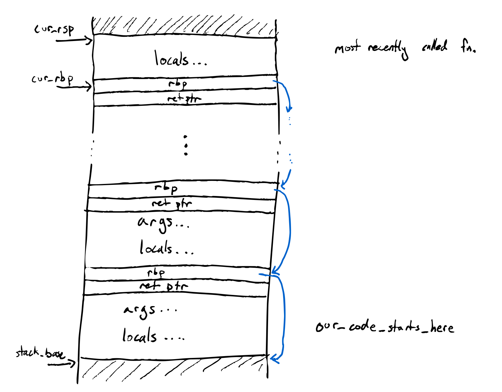

 Due Jun 3 (Closed Collaboration)

In this assignment you'll implement garbage collection for a language called 
[Gardener] which uses our design for heap allocation.

[Gardener](https://cdn.britannica.com/15/220215-050-B1C41241/Common-Garter-Snake.jpg

## Setup

For this assignment, you will (as in previous assignments) submit both a
compiler and a runtime.

Since garbage collection is a runtime feature, we provide a working
Gardener compiler for you: ([github classroom], [public starter code]).
If you use the starter code, you'll only have to modify the runtime.
However, feel free to instead update your own Egg-Eater compiler to match the Forest
Flame spec.

If you are participating in the Rust error study, please make sure you have the
`build.rs` and `config.txt` files in the new repository and set a new `project`
value in `config.txt` if you are using the starter code.

## The Gardener Language

The Gardener language extends Diamondback with heap allocation and garbage
collection.

### Concrete Syntax

```
<prog> := <defn>* <expr>
<defn> := (fun (<name> <name>*) <expr>)
<expr> :=
  | <number>
  | true
  | false
  | nil
  | input
  | <identifier>
  | (let (<binding>+) <expr>)
  | (<op1> <expr>)
  | (<op2> <expr> <expr>)
  | (set! <name> <expr>)
  | (if <expr> <expr> <expr>)
  | (block <expr>+)
  | (loop <expr>)
  | (break <expr>)
  | (gc)
  | (vec <expr>*)
  | (make-vec <expr> <expr>)
  | (vec-get <expr> <expr>)
  | (vec-set! <expr> <expr> <expr>)
  | (vec-len <expr>)
  | (<name> <expr>*)
optionally:
  | (snek-<name> <expr>*)

<op1> := add1 | sub1 | isnum | isbool | isvec | print
<op2> := + | - | * | / | < | > | >= | <= | =

<binding> := (<identifier> <expr>)
```

The new pieces of syntax are `nil`, `gc`, `vec`, `make-vec`, `vec-get`,
`vec-set!`, `vec-len`, `isvec`, and `/` (division).

Additionally, it allows for any implementation-defined extra operations that
start with `snek-`,
which compilers for Gardener may implement or not as they like.
The starter code implements a `(snek-printstack)` operation.

### Semantics

Gardener adds the runtime type of *vectors*.
A vector is either `nil` or a heap-allocated list of zero or more elements.

It adds these new syntax constructs:

 - `nil` evaluates to the `nil` vector.

 - `(gc)` forces the garbage collector to run, and returns 0.

 - `(vec arg1 ... argN)` allocates a new vector on the heap of size `N` with
   contents `[arg1, ..., argN]`.

 - `(make-vec count value)` allocates a new vector on the heap of size `count`
   with contents `[value, value, value, ...]`.

   It gives a runtime error if `count` does not evaluate to a number, or if it
   evaluates to a negative number.

 - `(vec-get vec index)` gets the `index`th component of `vec`.

   It gives a runtime error if `vec` does not evaluate to a non-nil vector or if
   `index` does not evaluate to a valid (0-based) index into the vector.

 - `(vec-set! vec index value)` sets the `index`th component of `vec` to
   `value` and returns `vec`.

   It gives a runtime error if `vec` does not evaluate to a non-nil vector or if
   `index` does not evaluate to a valid (0-based) index into the vector.

 - `(vec-len vec)` returns number of items of `vec`.

   It gives a runtime error if `vec` does not evaluate to a non-nil vector.

 - `(isvec value)` returns `true` if `value` is a vector (possibly nil) and
   `false` otherwise.

 - `(/ x y)` implements division and gives a runtime error if the denominator
   `y` is zero.

 - `(snek-<name> args...)`: the specification and behavior of operations
   beginning with `snek-` is implementation-defined.
   This means compilers can do whatever they want with these operations.

   The motivation is to make debugging your GC easier: feel free to add whatever
   built-in debugging operations would be helpful. For example, the starter code
   compiler implements a `(snek-printstack)` operation.

 - `=` should implement reference equality for vectors.

 - Vectors are printed as comma-separated lists surrounded by square brackets,
   `nil` is printed as `nil`, and cyclic references should be printed as
   `[...]`.

   For example, the cyclic linked list containing `true` and `nil` would be
   printed as `[true, [nil, [...]]]`.

In addition, the compiled program now takes *two* arguments instead of just one.

 - The first argument is the input, which may be `true`, `false`, or a number.
   If no arguments are provided, the default input is `false`.

 - The second argument is the *heap size* in (8-byte) words, which must be a
   nonnegative number. If no second argument is provided, the default heap size
   is 10000.

During a program's execution, if heap space runs out, it runs the garbage
collector. If there is still not enough heap space, it exits with the error `out
of memory`.

### Examples

This program implements several linked list manipluations, which involve
allocating a lot of data which eventually becomes garbage.
It prints out `"1\n2\n3\n4\n5\n5\n4\n3\n2\n1"`.

```scheme
(fun (range n m)
  (if (= n m) (vec n nil) (vec n (range (add1 n) m))))

(fun (append list1 list2)
  (if (= list1 nil)
      list2
      (vec (vec-get list1 0) (append (vec-get list1 1) list2))))

(fun (reverse list)
  (if (= list nil) nil (append (reverse (vec-get list 1)) (vec (vec-get list 0) nil))))

(fun (printall list) (loop
  (if (= list nil) (break nil) (block
    (print (vec-get list 0))
    (set! list (vec-get list 1))
  ))))

(let ((list (range 1 5)))
  (printall (append list (reverse list))))
```

See also the other examples in the `tests/` directory of the starter code.

## Garbage collection

You will edit `runtime/start.rs` to implement a mark-compact garbage collector,
as described in lecture.

### Object layout

A Gardener heap object has two metadata words, followed by the actual data.

 - First, there is a GC word, used to store the mark bit and the forwarding
   pointer during garbage collection. Outside of garbage collection, the GC word
   is always `0`.
 - Next, there is a word which stores the length of the vector. (Note that a
   vector of length `len` actually uses `len + 2` words, from the metadata.)
 - Next, there is each element of the vector, in order.

For example, the data `(vec false true 17)` stored at heap address `0x100` would
be represented by the value `0x101` and this heap data:



As a running example, consider this program, run with a heap size of 15 words:

```scheme
(let ((x (vec false true 17))
      (y (vec 1 2)))
     (block
        (set! x (vec nil y nil))
        (set! y nil)
        (gc)))
```

At the start of collection, the heap looks like this:



The stack contains the variables `x` and `y`. `x` has value `0x149` = `C` and
`y` is `nil`, so the root set is {`C`}.

### Marking

The first step of mark-compact is marking. We mark a heap object by setting its
mark bit, the lowest bit of the GC word. Marking does a graph traversal of the
heap, starting from the roots found on the stack.

Here's what the heap looks like after marking:



Since object A is not marked, we know that it's dead and we can safely remove it
from the heap.

### Compacting

The second step of mark-compact is compacting. Compacting has three parts:

 1. Computing forwarding locations
 2. Updating references
 3. Moving objects

#### Compacting 1: compute forwarding addresses

Once marking is finished, we now know which objects are still alive and which
are garbage based on whether the mark bit is set in the GC header. Objects which
are still alive get forwarding addresses: this is its *new* address that it will
be moved to after compacting. Computing forwarding addresses is done by a
linear scan though the heap. Here's what the heap looks like afterwards:


#### Compacting 2: update references

In order to move an object, we also have to update all references to that object
to point to the new location. We do this by a linear scan though both the heap
*and* the stack, changing each vector to point to the vector's eventual new
location. Here's what the heap looks like afterwards:



Note that the heap address stored in object C has been changed, and on the
stack, the stack slot storing the variable `x` has been updated to `0x121`.

#### Compacting 3: move the objects

Lastly, we do the actual compacting, moving heap objects to their destinations.
This is also a linear scan through the heap. Here's the final result:



## Starter code

The starter code contains the function headers for `snek_try_gc` and `snek_gc`
which need to be implemented. `snek_gc` is called by the `(gc)` operation, and
`snek_try_gc` is called when there is not enough room for an allocation.

### Heap layout

The `static mut` Rust variable `HEAP_START` has the address of the start of
the heap, and `HEAP_END` has the address of the end of the heap. These are set
once in `main` when the heap is allocated, and should never change again
throughout the running of the program.

Like the lecture compiler, the starter code uses `r15` as a heap pointer. It is
passed to the functions `snek_gc` and `snek_try_gc` as the argument `heap_ptr`.
The space between `HEAP_START` and `heap_ptr` is full of objects, and the space
between `heap_ptr` and `HEAP_END` is free.

### Stack layout

Not everything on the stack is a snek value -- there's also return addresses and
some saved registers in there. So, to traverse the stack, it helps to know the
exact layout of what it looks like.

The starter code compiler uses a stack frame layout that'll be hopefully
familiar if you've talked about stack frames in other classes, by using `rbp` as
the frame pointer. This means that during a function's execution, `rbp` points
to the bottom of the current function's stack frame.

On function entry, the function:

 - Pushes the old value of `rbp`
 - Saves `rsp` in `rbp`
 - Subtracts an amount of words from `rsp` to make room for local variables

Then, on function exit, it:

 - Moves `rsp` back to where it used to be
 - Restores the old value of `rbp` by popping it

(These operations are so common that x86 even has [special][enter]
[instructions][leave] for them!)
Concretely, the stack ends up looking like this:

[enter]: https://www.felixcloutier.com/x86/enter
[leave]: https://www.felixcloutier.com/x86/leave



## Submission, testing, and grading

Submit via Gradescope.

We will test that your compiler + runtime (a) works, (b) runs out of memory when
it should, and (c) doesn't run out of memory when it shouldn't.

- Your runtime should only allocate as many words of heap space as specified by
  the command-line argument.
- Your runtime needs to be able to use the whole heap (so you're more or less
  forced to use mark/compact)
- Data on the heap is *live* if it is reachable from some variable or some
  currently-in-use temporary storage. (This is exactly the data kept after a GC.)
- If, during an allocation, `(total live data size) + (new object size)` ≤
  `(total heap size)`, then the allocation should succeed. Otherwise, it should
  halt with the message `out of memory`. By “during an allocation”, we mean:
  - In a `make-vec` expression _after_ the value and size subexpressions have
    been evaluated
  - In a `vec` expression _after_ the element expressions have been evaluated

  (This is relevant because it specifies that an expression like `(vec (+ nil
  9))` could never trigger out-of-memory, it would _only_ error because of the
  runtime tag check on `+`. We aren't actively trying to test for these kinds
  of specific cases, but it helps to disambiguate.)

This assignment is officially **closed to collaboration**, but we have some
specific categories where we encourage you to share:

- You may share test cases with your peers by submitting them to the [**student
  test repo**] below. Have test cases case you think will break your
  classmates' GCs? Test cases that helped you fix a bug? Cool programs you just
  want to share? Make a PR! We'll merge in the pull requests every day or two.
- You may share (publicly on EdStem or otherwise) diagrams or other
  representations of the heap + stack at various stages in garbage collection
  to understand examples

Student Test Repo: <https://github.com/ucsd-cse231/gardener-student-tests>

## Extension: simple generational GC

Nearly all modern garbage collectors take advantage of
the high infant mortality rate for heap allocations, by segregating the heap
into multiple *generations*, each of which stores data of a particular age, and
processing the older generations less frequently than the younger generations.

In this extension, you'll implement this idea by adding a **nursery** to your
GC.

 - The nursery should be around 10% of the size of the old space (the main
   mark-compact heap).
 - Allocations go into the nursery (i.e., `r15` points into here); when nursery
   space runs out, this triggers a **minor collection**.
   (Large objects which don't fit into the nursery should be allocated directly
   to the old space.)
 - A minor collection *evacuates* the nursery, reallocating all its live objects
   into the old space (using the copying GC algorithm). When main heap space
   runs out, this triggers a **major collection**.
 - A major collection collects both the nursery and the old space, compacting
   both the old space and the nursery into the old space.

**Write barriers and the remembered set.**
What root set do we use for a minor collection? Pointers into the nursery can
come from two sources: the stack, or the old space. The stack is typically
quite small, but we want to avoid traversing the whole old space -- after all,
this is what makes a minor collection fast.

So in order to find roots from the old space, we'll make the program keep a log
of which old-space objects contain pointers into the nursery. This has a runtime
component and a compiler component:

 - At run time, we need a physical datastructure (usually called the *remembered
   set*) to record which old-space objects may contain pointers into the
   nursery. A good option here is an array of pointers to old-space objects,
   together with a header flag in each old-space object saying whether it's
   already in the remembered set. When the array fills up, you could either
   resize it, or reset it by triggering a minor collection.
 - Before writing to the heap in `vec-set!`, we need to check if it's putting a
   pointer into the nursery into the old space, and if so, update the remembered
   set accordingly. This requires compiler support. (In general, any kind of
   GC-related check that happens during memory writes is called a *write
   barrier*.)
